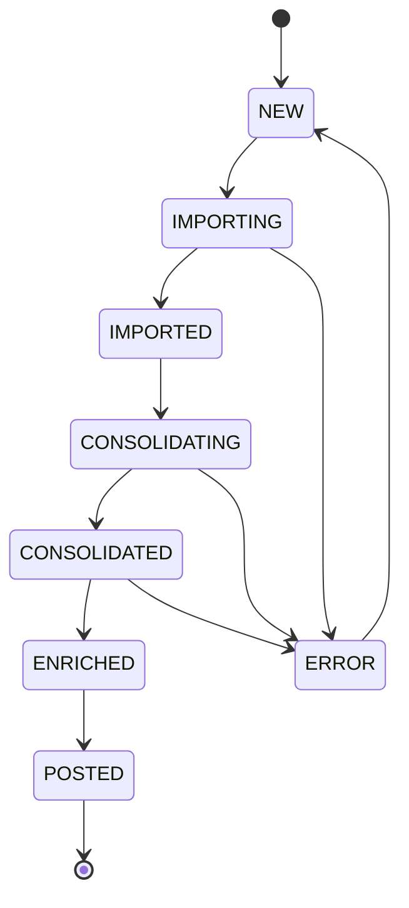
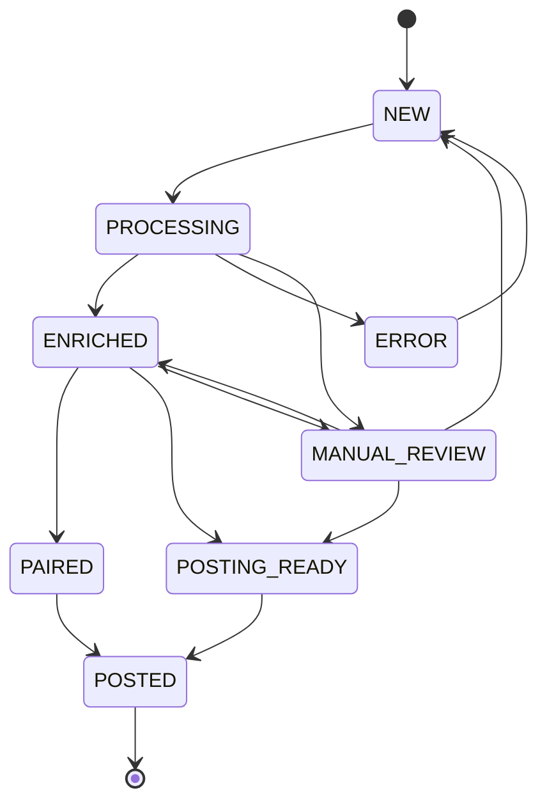
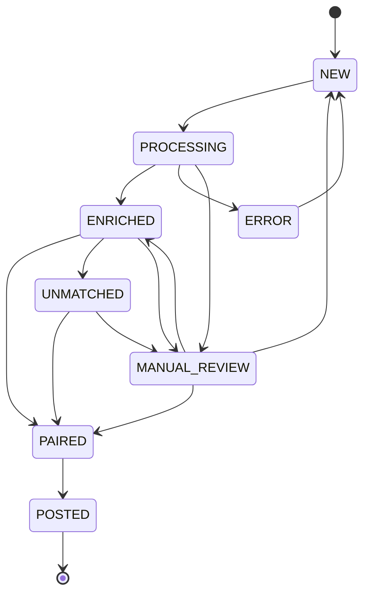
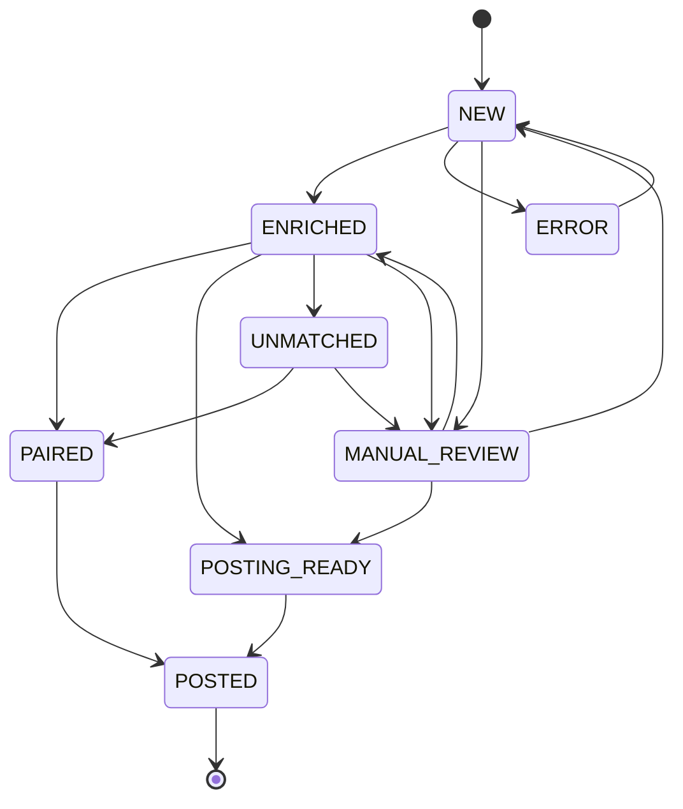
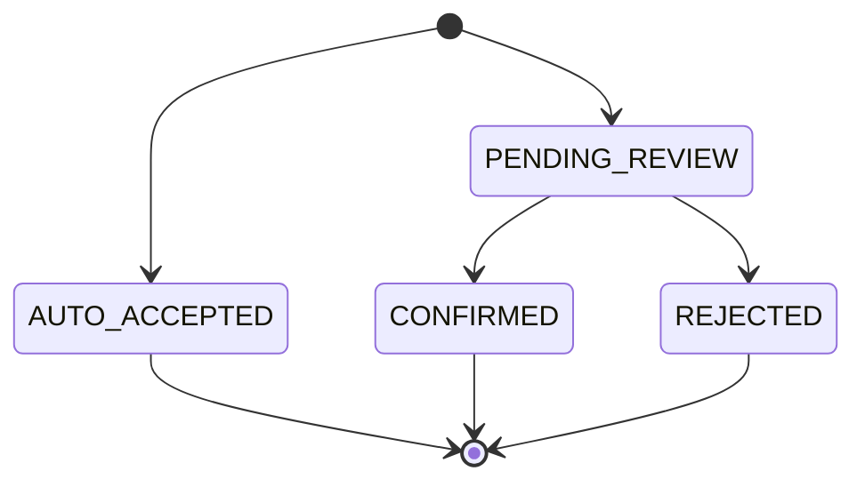
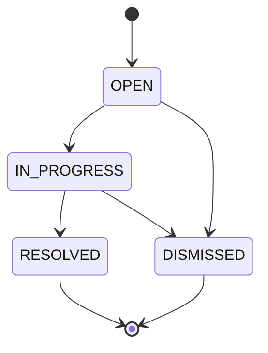

# GAM Framework

Shared framework module for GAM Joget plugins — centralized status lifecycle management, constants, and utilities.

## Overview

This module provides a **single source of truth** for status transitions across all GAM entities. All GAM plugins depend on this framework to ensure consistent state management and audit logging.

## Installation

Add as a dependency in your plugin's `pom.xml`:

```xml
<dependency>
    <groupId>com.fiscaladmin.gam</groupId>
    <artifactId>gam-framework</artifactId>
    <version>8.1-SNAPSHOT</version>
</dependency>
```

## Usage

### Transitioning Status

```java
import com.fiscaladmin.gam.framework.status.*;

// Get the DAO from Joget's Spring context
FormDataDao dao = StatusManager.getFormDataDao();

// Create manager and transition
StatusManager manager = new StatusManager();
manager.transition(
    dao,
    EntityType.BANK_TRX,
    recordId,
    Status.ENRICHED,
    "my-plugin-name",    // triggeredBy
    "Enrichment complete" // reason for audit log
);
```

### Validating Before Transition

```java
StatusManager manager = new StatusManager();

// Check if transition is allowed (no DB access)
if (manager.canTransition(EntityType.BANK_TRX, Status.PROCESSING, Status.ENRICHED)) {
    // proceed
}

// Get all valid next states
Set<Status> validTargets = manager.getValidTransitions(EntityType.BANK_TRX, Status.PROCESSING);
```

### Using Status Enum

```java
// Always use Status enum, never string literals
Status current = Status.fromCode(row.getProperty("status"));
row.setProperty("status", Status.ENRICHED.getCode());

// For UI dropdowns
String label = Status.ENRICHED.getLabel(); // "Enriched"
```

## Architecture

### State Machine Diagrams

#### Statement Lifecycle



#### Bank Transaction Lifecycle



#### Security Transaction Lifecycle



#### Enrichment Lifecycle



#### Pair Lifecycle



#### Exception Lifecycle



### Entity Types

| Entity | Table Name | Description |
|--------|------------|-------------|
| `STATEMENT` | `bank_statement` | Bank statement files |
| `BANK_TRX` | `bank_total_trx` | Bank transactions |
| `SECU_TRX` | `secu_total_trx` | Security transactions |
| `ENRICHMENT` | `trx_enrichment` | Transaction enrichment records |
| `PAIR` | `trx_pair` | Transaction pairing records |
| `EXCEPTION` | `exception_queue` | Exception queue items |

### Audit Logging

Every transition automatically writes to the `audit_log` table:

| Field | Description |
|-------|-------------|
| `entity_type` | STATEMENT, BANK_TRX, etc. |
| `entity_id` | Record primary key |
| `from_status` | Previous status code |
| `to_status` | New status code |
| `triggered_by` | Plugin name or "OPERATOR" |
| `reason` | Human-readable explanation |
| `timestamp` | ISO 8601 timestamp |

## Building

```bash
mvn clean package
```

## Testing

```bash
# All tests
mvn test

# Single test class
mvn test -Dtest=StatusManagerTest

# Single test method
mvn test -Dtest=StatusManagerTest#testValidTransition
```

## Requirements

- Java 11+
- Joget DX 8.1
