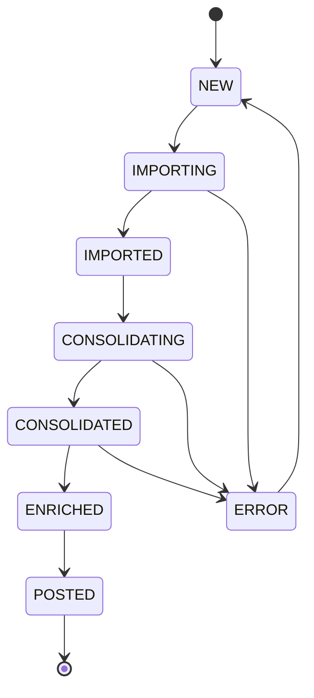
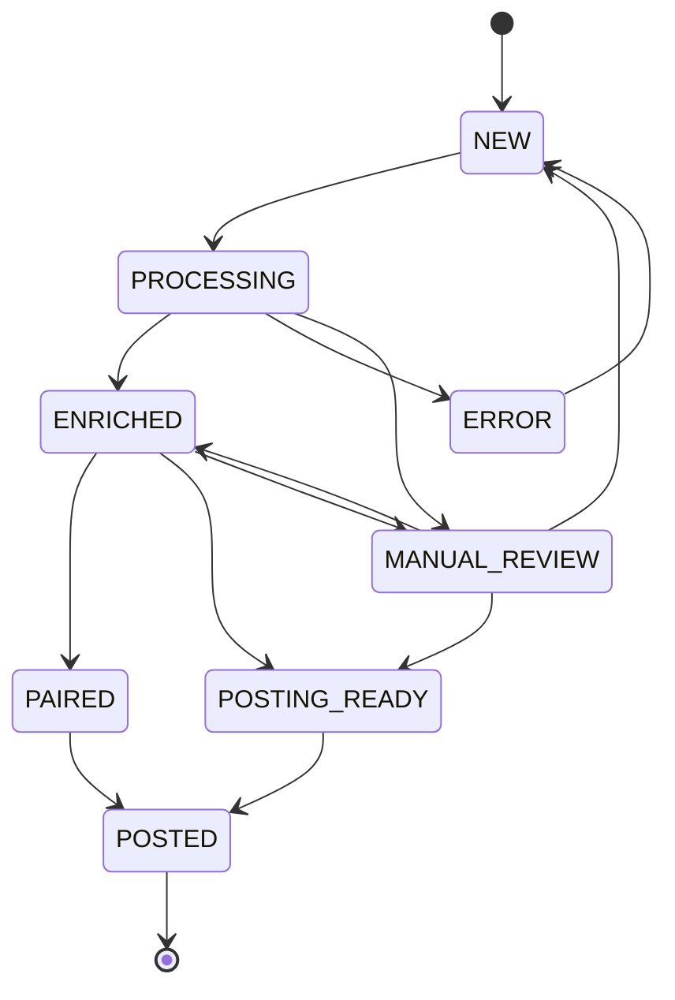
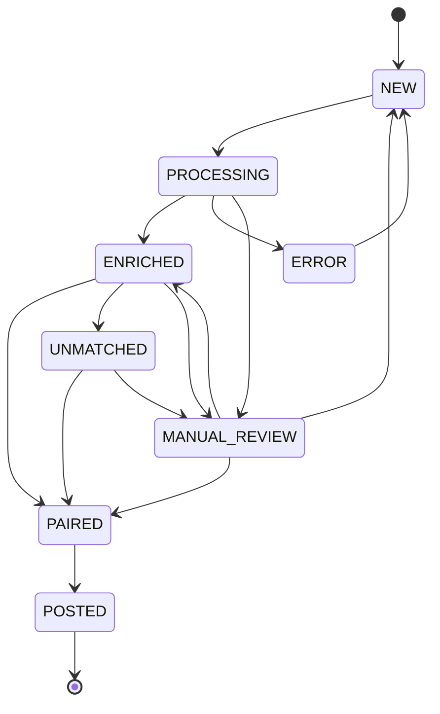
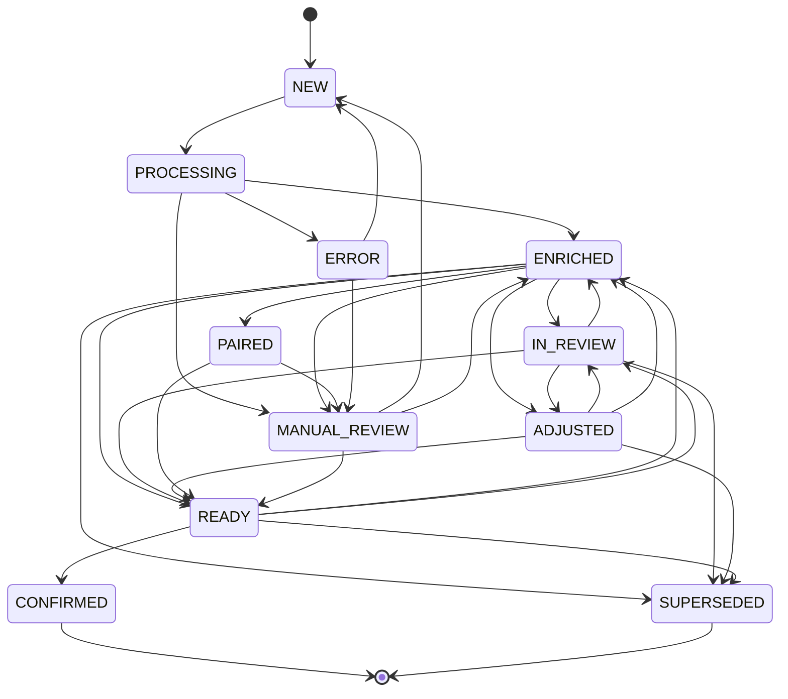
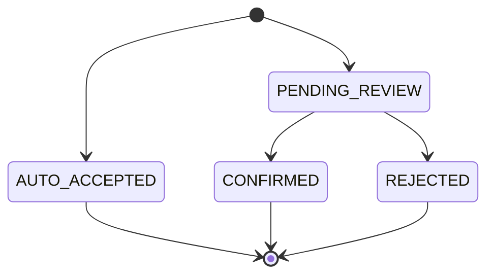
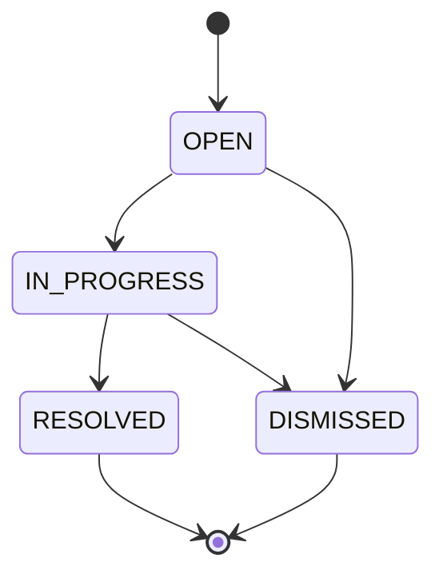
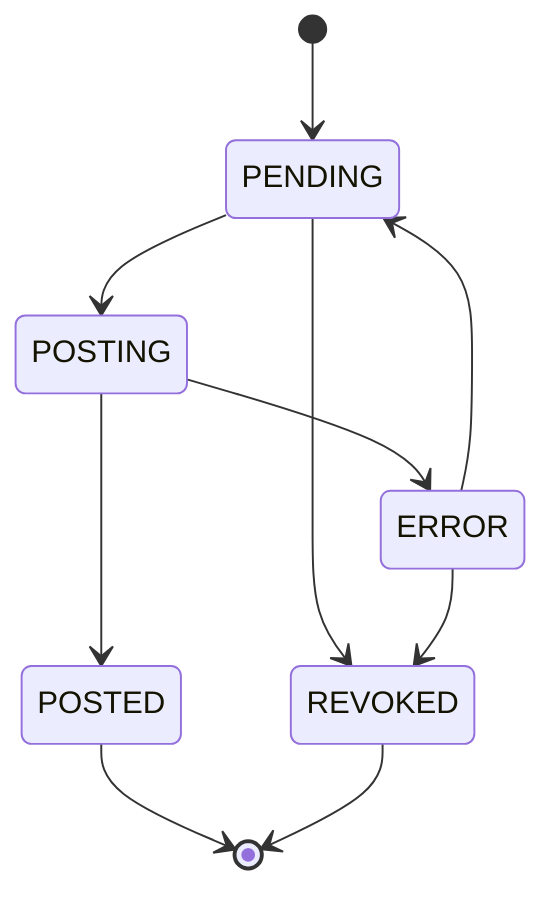

# GAM Framework

Shared framework module for GAM Joget plugins — centralized status lifecycle management, constants, and utilities.

## Overview

This module provides a **single source of truth** for status transitions across all GAM entities. All GAM plugins depend on this framework to ensure consistent state management and audit logging.

## Installation

Add as a dependency in your plugin's `pom.xml`:

```xml
<dependency>
    <groupId>com.fiscaladmin.gam</groupId>
    <artifactId>gam-framework</artifactId>
    <version>8.1-SNAPSHOT</version>
</dependency>
```

Deploy the built JAR to Joget's shared classpath:

```bash
cp target/gam-framework-8.1-SNAPSHOT.jar {JOGET_HOME}/wflow/lib/
```

## Usage

### Transitioning Status

```java
import com.fiscaladmin.gam.framework.status.*;

// Get the DAO from Joget's Spring context
FormDataDao dao = StatusManager.getFormDataDao();

// Transition (all methods are static)
StatusManager.transition(
    dao,
    EntityType.BANK_TRX,
    recordId,
    Status.ENRICHED,
    "my-plugin-name",    // triggeredBy
    "Enrichment complete" // reason for audit log
);
```

When the Joget form table name differs from `EntityType.getTableName()`, use the custom-table overload:

```java
StatusManager.transition(
    dao,
    "trxEnrichment",         // actual Joget form table name
    EntityType.ENRICHMENT,   // entity type (for transition validation)
    recordId,
    Status.IN_REVIEW,
    "enrichment-api",
    "Customer opened for review"
);
```

### Validating Before Transition

```java
// Check if transition is allowed (no DB access)
if (StatusManager.canTransition(EntityType.BANK_TRX, Status.PROCESSING, Status.ENRICHED)) {
    // proceed
}

// Get all valid next states
Set<Status> validTargets = StatusManager.getValidTransitions(EntityType.BANK_TRX, Status.PROCESSING);
```

### Using Status Enum

```java
// Always use Status enum, never string literals
Status current = Status.fromCode(row.getProperty("status"));
row.setProperty("status", Status.ENRICHED.getCode());

// For UI dropdowns
String label = Status.ENRICHED.getLabel(); // "Enriched"
```

### Handling Transition Errors

```java
try {
    StatusManager.transition(dao, EntityType.STATEMENT, recordId,
            Status.POSTED, "my-plugin", "Posting complete");
} catch (InvalidTransitionException e) {
    // e.getEntityType(), e.getRecordId(), e.getFromStatus(), e.getToStatus()
    LogUtil.error(getClass().getName(), e, e.getMessage());
}
```

## Architecture

### Entity Types

| Entity | Table Name | Initial Status | Description |
|--------|------------|----------------|-------------|
| `STATEMENT` | `bank_statement` | `NEW` | Bank statement files |
| `BANK_TRX` | `bank_total_trx` | `NEW` | Bank transactions |
| `SECU_TRX` | `secu_total_trx` | `NEW` | Security transactions |
| `ENRICHMENT` | `trxEnrichment` | `NEW` | Transaction enrichment workspace records |
| `PAIR` | `trx_pair` | `AUTO_ACCEPTED` / `PENDING_REVIEW` | Transaction pairing records |
| `EXCEPTION` | `exception_queue` | `OPEN` | Exception queue items |
| `POSTING_OPERATION` | `posting_operation` | `PENDING` | GL posting commitment records |

### State Machine Diagrams

#### Statement Lifecycle


```mermaid
stateDiagram-v2
    [*] --> NEW
    NEW --> IMPORTING
    IMPORTING --> IMPORTED
    IMPORTING --> ERROR
    IMPORTED --> CONSOLIDATING
    CONSOLIDATING --> CONSOLIDATED
    CONSOLIDATING --> ERROR
    CONSOLIDATED --> ENRICHED
    CONSOLIDATED --> ERROR
    ENRICHED --> POSTED
    ERROR --> NEW
    POSTED --> [*]
```

#### Bank Transaction Lifecycle


```mermaid
stateDiagram-v2
    [*] --> NEW
    NEW --> PROCESSING
    PROCESSING --> ENRICHED
    PROCESSING --> ERROR
    PROCESSING --> MANUAL_REVIEW
    ENRICHED --> PAIRED
    ENRICHED --> POSTING_READY
    ENRICHED --> MANUAL_REVIEW
    POSTING_READY --> POSTED
    PAIRED --> POSTED
    ERROR --> NEW
    MANUAL_REVIEW --> NEW
    MANUAL_REVIEW --> ENRICHED
    MANUAL_REVIEW --> POSTING_READY
    POSTED --> [*]
```

#### Security Transaction Lifecycle


```mermaid
stateDiagram-v2
    [*] --> NEW
    NEW --> PROCESSING
    PROCESSING --> ENRICHED
    PROCESSING --> ERROR
    PROCESSING --> MANUAL_REVIEW
    ENRICHED --> PAIRED
    ENRICHED --> UNMATCHED
    ENRICHED --> MANUAL_REVIEW
    PAIRED --> POSTED
    UNMATCHED --> PAIRED
    UNMATCHED --> MANUAL_REVIEW
    ERROR --> NEW
    MANUAL_REVIEW --> NEW
    MANUAL_REVIEW --> ENRICHED
    MANUAL_REVIEW --> PAIRED
    POSTED --> [*]
```

#### Enrichment Workspace Lifecycle


```mermaid
stateDiagram-v2
    [*] --> NEW
    NEW --> PROCESSING
    PROCESSING --> ENRICHED
    PROCESSING --> ERROR
    PROCESSING --> MANUAL_REVIEW

    ENRICHED --> IN_REVIEW
    ENRICHED --> ADJUSTED
    ENRICHED --> READY
    ENRICHED --> PAIRED
    ENRICHED --> MANUAL_REVIEW
    ENRICHED --> SUPERSEDED

    IN_REVIEW --> ADJUSTED
    IN_REVIEW --> READY
    IN_REVIEW --> ENRICHED
    IN_REVIEW --> SUPERSEDED

    ADJUSTED --> READY
    ADJUSTED --> IN_REVIEW
    ADJUSTED --> ENRICHED
    ADJUSTED --> SUPERSEDED

    READY --> CONFIRMED
    READY --> ENRICHED
    READY --> IN_REVIEW
    READY --> SUPERSEDED

    PAIRED --> READY
    PAIRED --> MANUAL_REVIEW

    ERROR --> NEW
    ERROR --> MANUAL_REVIEW
    MANUAL_REVIEW --> NEW
    MANUAL_REVIEW --> ENRICHED
    MANUAL_REVIEW --> READY

    CONFIRMED --> [*]
    SUPERSEDED --> [*]
```

#### Pair Lifecycle


```mermaid
stateDiagram-v2
    [*] --> AUTO_ACCEPTED
    [*] --> PENDING_REVIEW
    PENDING_REVIEW --> CONFIRMED
    PENDING_REVIEW --> REJECTED
    AUTO_ACCEPTED --> [*]
    CONFIRMED --> [*]
    REJECTED --> [*]
```

#### Exception Lifecycle


```mermaid
stateDiagram-v2
    [*] --> OPEN
    OPEN --> IN_PROGRESS
    OPEN --> DISMISSED
    IN_PROGRESS --> RESOLVED
    IN_PROGRESS --> DISMISSED
    RESOLVED --> [*]
    DISMISSED --> [*]
```

#### Posting Operation Lifecycle


```mermaid
stateDiagram-v2
    [*] --> PENDING
    PENDING --> POSTING
    PENDING --> REVOKED
    POSTING --> POSTED
    POSTING --> ERROR
    ERROR --> PENDING
    ERROR --> REVOKED
    POSTED --> [*]
    REVOKED --> [*]
```

### Audit Logging

Every transition automatically writes to the `audit_log` table:

| Field | Description | Example |
|-------|-------------|---------|
| `entity_type` | Entity type name | `STATEMENT`, `BANK_TRX` |
| `entity_id` | Record primary key | `S001` |
| `from_status` | Previous status code | `new`, `null` (initial) |
| `to_status` | New status code | `importing` |
| `triggered_by` | Plugin name or `"OPERATOR"` | `statement-importer` |
| `reason` | Human-readable explanation | `File upload started` |
| `timestamp` | ISO 8601 timestamp | `2026-03-03T10:15:30.123Z` |

### Class Reference

| Class | Description |
|-------|-------------|
| `Status` | Enum with 28 values. Each has `getCode()` (DB value) and `getLabel()` (UI label). Use `fromCode(String)` for reverse lookup (returns `null` for unknown codes). |
| `EntityType` | Enum with 7 values. Each maps to a bare Joget table name via `getTableName()`. |
| `StatusManager` | All-static API. Validates transitions, writes to entity table, writes audit log. Two `transition()` overloads (standard and custom-table). |
| `InvalidTransitionException` | Checked exception with `getEntityType()`, `getRecordId()`, `getFromStatus()`, `getToStatus()`. |
| `TransitionAuditEntry` | Immutable `final` DTO with typed fields (`EntityType`, `Status`). Timestamp auto-generated. `toFormRow()` converts to Joget `FormRow` for persistence. |

## Building

```bash
mvn clean package
```

## Testing

```bash
# All tests (128 total)
mvn test

# Single test class
mvn test -Dtest=StatusManagerTest

# Single test method
mvn test -Dtest=StatusManagerTest#testValidTransition
```

## Requirements

- Java 11+
- Joget DX 8.1
